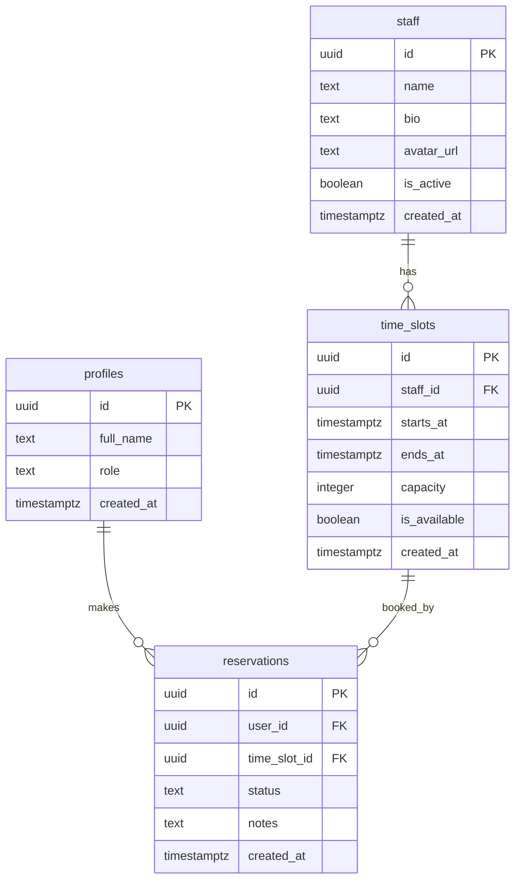

Next.js と Supabase の組み合わせで予約システムを作ろうとすると、「DB 設計をどうするか」「認証とロール管理をどう実装するか」「カレンダー UI の空き枠ロジックをどう設計するか」という悩みが一気に押し寄せます。

この記事は実装チュートリアルではなく、**設計メモとして読んでもらうことを意図**しています。コードを書く前に設計の全体像を固めておきたい人、または既存の予約システムのアーキテクチャを見直したい人に向けています。

## この記事で作るもの

作るのは**汎用予約システム**です。美容室・パーソナルトレーナー・コーチング等、スタッフが枠を設定し、ユーザーが予約を入れるタイプのサービスを想定しています。

### 画面構成

```
【ユーザー向け画面】
/ (トップ)
  └── /book
        ├── スタッフ選択
        ├── 日時選択（カレンダーUI）
        └── 予約確認・完了

/dashboard/user
  ├── 予約一覧
  └── 予約キャンセル

【管理者向け画面】
/dashboard/admin
  ├── 予約一覧（全スタッフ分）
  ├── 枠設定（time_slots の CRUD）
  └── スタッフ管理
```

### 主な機能

- メール + Google ログイン（Supabase Auth）
- ユーザー / 管理者のロール分離
- カレンダーから空き枠を選んで予約
- 予約確定メール・リマインダー通知
- 管理者ダッシュボードでの予約管理

## 技術選定

| 技術 | 選定理由 |
|------|---------|
| **Next.js (App Router)** | Server Components でデータフェッチを Server 側に寄せられる。API Route が不要なケースも多い |
| **Supabase** | DB + Auth + Edge Functions + Realtime をまとめて提供。RLS でテーブルアクセスをポリシーとして管理できる |
| **Tailwind CSS** | ユーティリティクラスで UI の試行錯誤が速い |
| **Vercel** | Next.js との相性が最も良い。Edge Runtime と Supabase のラテンシも許容範囲 |

### なぜ Supabase を選ぶか

Firebase と比較したときの Supabase の強みは **PostgreSQL をそのまま使えること**です。予約システムは「枠の空き判定」や「スタッフごとの予約集計」など、SQL の JOIN が活きる場面が多い。RLS（Row Level Security）で「自分の予約しか取得できない」というポリシーをテーブル側で担保できるのも大きいです。

### Supabase クライアントの初期化（App Router）

```typescript
// lib/supabase/server.ts
import { createServerClient } from "@supabase/ssr";
import { cookies } from "next/headers";

export function createClient() {
  const cookieStore = cookies();
  return createServerClient(
    process.env.NEXT_PUBLIC_SUPABASE_URL!,
    process.env.NEXT_PUBLIC_SUPABASE_ANON_KEY!,
    {
      cookies: {
        getAll() {
          return cookieStore.getAll();
        },
        setAll(cookiesToSet) {
          cookiesToSet.forEach(({ name, value, options }) =>
            cookieStore.set(name, value, options)
          );
        },
      },
    }
  );
}
```

```typescript
// lib/supabase/client.ts
import { createBrowserClient } from "@supabase/ssr";

export function createClient() {
  return createBrowserClient(
    process.env.NEXT_PUBLIC_SUPABASE_URL!,
    process.env.NEXT_PUBLIC_SUPABASE_ANON_KEY!
  );
}
```

Server Components では `lib/supabase/server.ts` を、Client Components では `lib/supabase/client.ts` を使う、という使い分けが基本です。

## DB 設計

### テーブル設計

予約システムを構成する主なテーブルは4つです。

```sql
-- ユーザープロフィール（Supabase Auth の users テーブルを参照）
CREATE TABLE public.profiles (
  id          UUID PRIMARY KEY REFERENCES auth.users(id) ON DELETE CASCADE,
  full_name   TEXT,
  role        TEXT NOT NULL DEFAULT 'user' CHECK (role IN ('user', 'admin')),
  created_at  TIMESTAMPTZ NOT NULL DEFAULT NOW(),
  updated_at  TIMESTAMPTZ NOT NULL DEFAULT NOW()
);

-- スタッフ
CREATE TABLE public.staff (
  id          UUID PRIMARY KEY DEFAULT gen_random_uuid(),
  name        TEXT NOT NULL,
  bio         TEXT,
  avatar_url  TEXT,
  is_active   BOOLEAN NOT NULL DEFAULT TRUE,
  created_at  TIMESTAMPTZ NOT NULL DEFAULT NOW()
);

-- 予約可能枠
CREATE TABLE public.time_slots (
  id           UUID PRIMARY KEY DEFAULT gen_random_uuid(),
  staff_id     UUID NOT NULL REFERENCES public.staff(id) ON DELETE CASCADE,
  starts_at    TIMESTAMPTZ NOT NULL,
  ends_at      TIMESTAMPTZ NOT NULL,
  capacity     INTEGER NOT NULL DEFAULT 1,
  is_available BOOLEAN NOT NULL DEFAULT TRUE,
  created_at   TIMESTAMPTZ NOT NULL DEFAULT NOW(),
  CONSTRAINT time_slots_no_overlap EXCLUDE USING gist (
    staff_id WITH =,
    tstzrange(starts_at, ends_at) WITH &&
  )
);

-- 予約
CREATE TABLE public.reservations (
  id           UUID PRIMARY KEY DEFAULT gen_random_uuid(),
  user_id      UUID NOT NULL REFERENCES auth.users(id) ON DELETE CASCADE,
  time_slot_id UUID NOT NULL REFERENCES public.time_slots(id) ON DELETE RESTRICT,
  status       TEXT NOT NULL DEFAULT 'confirmed'
               CHECK (status IN ('confirmed', 'cancelled', 'completed')),
  notes        TEXT,
  created_at   TIMESTAMPTZ NOT NULL DEFAULT NOW(),
  updated_at   TIMESTAMPTZ NOT NULL DEFAULT NOW()
);

-- インデックス
CREATE INDEX ON public.time_slots (staff_id, starts_at);
CREATE INDEX ON public.reservations (user_id, status);
CREATE INDEX ON public.reservations (time_slot_id);
```

`time_slots` に `EXCLUDE USING gist` 制約を入れているのがポイントです。同じスタッフの枠が時間的に重複して登録されることを DB レベルで防ぎます。`btree_gist` 拡張が必要です（Supabase のダッシュボードから有効化できます）。

### ER 図



### RLS ポリシー

RLS を有効にした上で、ロールに応じたアクセス制御をポリシーとして定義します。

```sql
-- RLS を有効化
ALTER TABLE public.profiles      ENABLE ROW LEVEL SECURITY;
ALTER TABLE public.staff         ENABLE ROW LEVEL SECURITY;
ALTER TABLE public.time_slots    ENABLE ROW LEVEL SECURITY;
ALTER TABLE public.reservations  ENABLE ROW LEVEL SECURITY;

-- profiles: 自分のプロフィールのみ参照・更新可
CREATE POLICY "profiles_select_own" ON public.profiles
  FOR SELECT USING (auth.uid() = id);

CREATE POLICY "profiles_update_own" ON public.profiles
  FOR UPDATE USING (auth.uid() = id);

-- staff: 全員が参照可（認証不要）
CREATE POLICY "staff_select_all" ON public.staff
  FOR SELECT USING (TRUE);

-- time_slots: 全員が参照可、管理者のみ作成・更新・削除可
CREATE POLICY "time_slots_select_all" ON public.time_slots
  FOR SELECT USING (TRUE);

CREATE POLICY "time_slots_admin_insert" ON public.time_slots
  FOR INSERT WITH CHECK (
    EXISTS (
      SELECT 1 FROM public.profiles
      WHERE id = auth.uid() AND role = 'admin'
    )
  );

CREATE POLICY "time_slots_admin_update" ON public.time_slots
  FOR UPDATE USING (
    EXISTS (
      SELECT 1 FROM public.profiles
      WHERE id = auth.uid() AND role = 'admin'
    )
  );

-- reservations: 自分の予約のみ参照可
CREATE POLICY "reservations_select_own" ON public.reservations
  FOR SELECT USING (auth.uid() = user_id);

-- reservations: ログイン済みユーザーが作成可
CREATE POLICY "reservations_insert_own" ON public.reservations
  FOR INSERT WITH CHECK (auth.uid() = user_id);

-- reservations: 自分の予約のみキャンセル可（status を cancelled に変更）
CREATE POLICY "reservations_update_own" ON public.reservations
  FOR UPDATE USING (auth.uid() = user_id);

-- reservations: 管理者は全ての予約を参照可
CREATE POLICY "reservations_admin_select" ON public.reservations
  FOR SELECT USING (
    EXISTS (
      SELECT 1 FROM public.profiles
      WHERE id = auth.uid() AND role = 'admin'
    )
  );
```

管理者の判定は `profiles.role = 'admin'` を参照する形にしています。Supabase の JWT クレームに role を埋め込む方法もありますが、プロフィールテーブルを参照する方が変更しやすいので、まずはこちらのシンプルな実装から始めます。

## 認証フロー

### Supabase Auth の設定

Supabase ダッシュボードの Authentication > Providers で Email と Google を有効にします。Google OAuth は Google Cloud Console でクライアント ID・シークレットを発行し、Supabase 側のリダイレクト URL を登録します。

```typescript
// app/login/page.tsx（Server Component）
import { createClient } from "@/lib/supabase/server";
import { redirect } from "next/navigation";

export default async function LoginPage() {
  const supabase = createClient();
  const { data: { user } } = await supabase.auth.getUser();

  // ログイン済みならダッシュボードへ
  if (user) redirect("/dashboard/user");

  return <LoginForm />;
}
```

```typescript
// components/LoginForm.tsx（Client Component）
"use client";
import { createClient } from "@/lib/supabase/client";

export function LoginForm() {
  const supabase = createClient();

  const signInWithGoogle = async () => {
    await supabase.auth.signInWithOAuth({
      provider: "google",
      options: {
        redirectTo: `${location.origin}/auth/callback`,
      },
    });
  };

  const signInWithEmail = async (email: string, password: string) => {
    const { error } = await supabase.auth.signInWithPassword({
      email,
      password,
    });
    if (error) console.error(error);
  };

  return (
    <div>
      <button onClick={signInWithGoogle}>Google でログイン</button>
      {/* メールフォームは省略 */}
    </div>
  );
}
```

### コールバックハンドラ

```typescript
// app/auth/callback/route.ts
import { createClient } from "@/lib/supabase/server";
import { NextResponse } from "next/server";

export async function GET(request: Request) {
  const { searchParams, origin } = new URL(request.url);
  const code = searchParams.get("code");

  if (code) {
    const supabase = createClient();
    await supabase.auth.exchangeCodeForSession(code);
  }

  return NextResponse.redirect(`${origin}/dashboard/user`);
}
```

### ロール分離

ログイン後のリダイレクト先と管理画面へのアクセス制御を、ミドルウェアで行います。

```typescript
// middleware.ts
import { createServerClient } from "@supabase/ssr";
import { NextResponse, type NextRequest } from "next/server";

export async function middleware(request: NextRequest) {
  const response = NextResponse.next();
  const supabase = createServerClient(
    process.env.NEXT_PUBLIC_SUPABASE_URL!,
    process.env.NEXT_PUBLIC_SUPABASE_ANON_KEY!,
    { cookies: { /* ... */ } }
  );

  const { data: { user } } = await supabase.auth.getUser();

  // 未ログインは /login へ
  if (!user && request.nextUrl.pathname.startsWith("/dashboard")) {
    return NextResponse.redirect(new URL("/login", request.url));
  }

  // 管理者ページは admin ロールのみ
  if (user && request.nextUrl.pathname.startsWith("/dashboard/admin")) {
    const { data: profile } = await supabase
      .from("profiles")
      .select("role")
      .eq("id", user.id)
      .single();

    if (profile?.role !== "admin") {
      return NextResponse.redirect(new URL("/dashboard/user", request.url));
    }
  }

  return response;
}

export const config = {
  matcher: ["/dashboard/:path*"],
};
```

### ユーザー登録時のプロフィール自動作成

`auth.users` にユーザーが登録された際、`profiles` テーブルにレコードを自動生成するトリガーを用意します。

```sql
CREATE OR REPLACE FUNCTION public.handle_new_user()
RETURNS TRIGGER AS $$
BEGIN
  INSERT INTO public.profiles (id, full_name)
  VALUES (
    NEW.id,
    NEW.raw_user_meta_data ->> 'full_name'
  );
  RETURN NEW;
END;
$$ LANGUAGE plpgsql SECURITY DEFINER;

CREATE TRIGGER on_auth_user_created
  AFTER INSERT ON auth.users
  FOR EACH ROW EXECUTE PROCEDURE public.handle_new_user();
```

## カレンダー UI

### 空き枠の表示ロジック

カレンダー UI の核心は「**ある日付の空き枠を取得する**」クエリです。`time_slots` と `reservations` を JOIN して、まだ予約が入っていない枠を返します。

```typescript
// lib/queries/time-slots.ts
import { createClient } from "@/lib/supabase/server";

export async function getAvailableSlots(staffId: string, date: string) {
  const supabase = createClient();

  // date は "2026-03-15" 形式を想定
  const from = `${date}T00:00:00+09:00`;
  const to   = `${date}T23:59:59+09:00`;

  const { data, error } = await supabase
    .from("time_slots")
    .select(`
      id,
      starts_at,
      ends_at,
      capacity,
      reservations(count)
    `)
    .eq("staff_id", staffId)
    .eq("is_available", true)
    .gte("starts_at", from)
    .lte("starts_at", to)
    .order("starts_at");

  if (error) throw error;

  // 残枠あり = capacity > 予約数
  return data?.filter(
    (slot) => slot.capacity > (slot.reservations?.[0]?.count ?? 0)
  );
}
```

### カレンダーコンポーネントの設計

```tsx
// components/BookingCalendar.tsx
"use client";
import { useState } from "react";

type TimeSlot = {
  id: string;
  starts_at: string;
  ends_at: string;
};

type Props = {
  staffId: string;
  onSlotSelect: (slotId: string) => void;
};

export function BookingCalendar({ staffId, onSlotSelect }: Props) {
  const [selectedDate, setSelectedDate] = useState<string | null>(null);
  const [slots, setSlots] = useState<TimeSlot[]>([]);
  const [loading, setLoading] = useState(false);

  const handleDateSelect = async (date: string) => {
    setSelectedDate(date);
    setLoading(true);
    try {
      // Server Actions or API Route 経由で空き枠を取得
      const res = await fetch(
        `/api/slots?staffId=${staffId}&date=${date}`
      );
      const data = await res.json();
      setSlots(data);
    } finally {
      setLoading(false);
    }
  };

  return (
    <div className="grid gap-4">
      {/* 月カレンダー部分（日付選択） */}
      <MonthCalendar
        onDateSelect={handleDateSelect}
        selectedDate={selectedDate}
      />

      {/* 時間枠一覧 */}
      {selectedDate && (
        <div className="grid grid-cols-3 gap-2">
          {loading ? (
            <p>読み込み中...</p>
          ) : slots.length === 0 ? (
            <p>空き枠がありません</p>
          ) : (
            slots.map((slot) => (
              <button
                key={slot.id}
                onClick={() => onSlotSelect(slot.id)}
                className="rounded border p-2 hover:bg-blue-50"
              >
                {formatTime(slot.starts_at)} - {formatTime(slot.ends_at)}
              </button>
            ))
          )}
        </div>
      )}
    </div>
  );
}

function formatTime(iso: string) {
  return new Date(iso).toLocaleTimeString("ja-JP", {
    hour: "2-digit",
    minute: "2-digit",
  });
}
```

### 予約の作成

```typescript
// app/actions/reservations.ts
"use server";
import { createClient } from "@/lib/supabase/server";
import { revalidatePath } from "next/cache";

export async function createReservation(timeSlotId: string, notes?: string) {
  const supabase = createClient();
  const { data: { user } } = await supabase.auth.getUser();

  if (!user) throw new Error("Unauthorized");

  const { error } = await supabase.from("reservations").insert({
    user_id: user.id,
    time_slot_id: timeSlotId,
    notes,
  });

  if (error) throw error;

  revalidatePath("/dashboard/user");
}
```

Server Actions を使うことで、クライアントから直接 `createReservation(slotId)` を呼び出すだけで済みます。API Route を別途作る必要がなく、型安全に呼び出せます。

## 管理画面

### 予約一覧

管理者が全予約を一覧表示するページです。Server Component として実装し、初回のデータフェッチをサーバー側で行います。

```tsx
// app/dashboard/admin/page.tsx
import { createClient } from "@/lib/supabase/server";

export default async function AdminDashboard() {
  const supabase = createClient();

  const { data: reservations } = await supabase
    .from("reservations")
    .select(`
      id,
      status,
      notes,
      created_at,
      profiles(full_name),
      time_slots(starts_at, ends_at, staff(name))
    `)
    .order("created_at", { ascending: false })
    .limit(50);

  return (
    <div>
      <h1 className="text-2xl font-bold">予約一覧</h1>
      <ReservationsTable reservations={reservations ?? []} />
    </div>
  );
}
```

### 枠設定

管理者が time_slots を登録・削除するフォームです。繰り返し枠（例: 毎週火曜10:00〜11:00）を一括登録する機能を持たせると運用が楽になります。

```typescript
// 繰り返し枠の一括挿入例
export async function createRecurringSlots({
  staffId,
  startDate,    // "2026-04-01"
  endDate,      // "2026-04-30"
  dayOfWeek,    // 0=日曜, 2=火曜...
  startHour,    // 10
  durationMin,  // 60
  capacity,     // 1
}: RecurringSlotParams) {
  const supabase = createClient();

  const slots = [];
  const current = new Date(startDate);
  const end = new Date(endDate);

  while (current <= end) {
    if (current.getDay() === dayOfWeek) {
      const starts = new Date(current);
      starts.setHours(startHour, 0, 0, 0);
      const ends = new Date(starts.getTime() + durationMin * 60_000);

      slots.push({
        staff_id: staffId,
        starts_at: starts.toISOString(),
        ends_at: ends.toISOString(),
        capacity,
      });
    }
    current.setDate(current.getDate() + 1);
  }

  const { error } = await supabase.from("time_slots").insert(slots);
  if (error) throw error;
}
```

### ダッシュボードの集計クエリ

```sql
-- 今月の予約数と売上（仮に単価を別途管理する場合）
SELECT
  COUNT(*) FILTER (WHERE status = 'confirmed')  AS confirmed_count,
  COUNT(*) FILTER (WHERE status = 'cancelled')  AS cancelled_count,
  COUNT(*) FILTER (WHERE status = 'completed')  AS completed_count
FROM reservations
WHERE created_at >= date_trunc('month', NOW());

-- スタッフ別の予約数
SELECT
  s.name AS staff_name,
  COUNT(r.id) AS reservation_count
FROM staff s
LEFT JOIN time_slots ts ON ts.staff_id = s.id
LEFT JOIN reservations r ON r.time_slot_id = ts.id
  AND r.status = 'confirmed'
WHERE ts.starts_at >= date_trunc('month', NOW())
GROUP BY s.id, s.name
ORDER BY reservation_count DESC;
```

## 通知設計

### メール通知の選択肢

予約確定メールとリマインダーの送信には、2つのアプローチがあります。

| アプローチ | メリット | デメリット |
|-----------|---------|-----------|
| **Supabase Edge Functions + Resend** | Supabase のトリガーやスケジュールと連携しやすい。Resend は Next.js エコシステムで使いやすい | Edge Functions のデプロイが別途必要 |
| **Next.js API Route + Resend** | 既存のコードベースに閉じている。Vercel との相性も良い | Cron はVercel の有料プランが必要 |

まず確定メールだけ実装するなら、**API Route + Resend** がシンプルです。リマインダーが必要になった段階で Edge Functions に移行するという判断でも問題ありません。

### 予約確定メール（Resend）

```typescript
// lib/email.ts
import { Resend } from "resend";

const resend = new Resend(process.env.RESEND_API_KEY);

export async function sendConfirmationEmail({
  to,
  userName,
  staffName,
  startsAt,
}: {
  to: string;
  userName: string;
  staffName: string;
  startsAt: Date;
}) {
  await resend.emails.send({
    from: "予約システム <noreply@example.com>",
    to,
    subject: "予約が確定しました",
    html: `
      <p>${userName} 様</p>
      <p>以下の内容で予約を承りました。</p>
      <ul>
        <li>担当: ${staffName}</li>
        <li>日時: ${startsAt.toLocaleString("ja-JP", { timeZone: "Asia/Tokyo" })}</li>
      </ul>
    `,
  });
}
```

Server Actions の `createReservation` 内で、INSERT 成功後にこの関数を呼び出します。

### リマインダー（Supabase Edge Functions）

前日リマインダーを送りたい場合は、Supabase の Cron（pg_cron）を使います。

```sql
-- 毎日 20:00 JST（11:00 UTC）に翌日の予約者にリマインドを送る
SELECT cron.schedule(
  'send-reminders',
  '0 11 * * *',
  $$
    SELECT net.http_post(
      url := 'https://<project>.supabase.co/functions/v1/send-reminders',
      headers := jsonb_build_object(
        'Authorization', 'Bearer ' || current_setting('app.service_role_key')
      )
    );
  $$
);
```

Edge Function 側で「翌日の予約を持つユーザー」をクエリして Resend でメールを送る、という実装です。

## まとめ

設計のポイントを振り返ります。

### DB 設計

- `time_slots` と `reservations` を分離することで、枠の管理と予約の管理を独立させる
- `EXCLUDE USING gist` で枠の重複を DB レベルで防ぐ
- `profiles.role` でロール管理し、RLS ポリシーで参照範囲を制限する

### 認証

- Supabase Auth の Email + Google OAuth で実装コストを最小化
- ミドルウェアでロールチェックし、管理画面へのアクセスを制御する
- `on_auth_user_created` トリガーでプロフィール自動生成を忘れずに

### UI

- Server Components でデータフェッチし、Client Components は状態管理に集中
- Server Actions で予約作成 → `revalidatePath` でキャッシュ更新

### 通知

- まず Resend で確定メール、リマインダーが必要になったら Supabase Edge Functions + pg_cron に拡張

### 実装時の Tips

- **枠の二重予約防止**: `reservations` の INSERT 前に、同じ `time_slot_id` で `status = 'confirmed'` のレコードが `capacity` 未満かをチェックする。DB のトランザクションで処理しないと競合が起きる可能性があります
- **タイムゾーン**: `timestamptz` で保存し、表示時に `Asia/Tokyo` に変換する方針を徹底する
- **ページネーション**: 管理画面の予約一覧は件数が増えるので、最初から `limit` + `offset` か Supabase の Cursor Pagination を使う設計にしておく

設計を固めてから実装に入ると、手戻りが減ります。この設計メモが役立てば幸いです。

---

:::message
**宣伝**: この記事で解説した内容を活用したアプリ「**ふくログ**」を作りました。

- 20万円ラインがプログレスバーで一目瞭然
- エンジニア向けの経費カテゴリ
- 無料で全機能使えます

App Storeで公開中です。
:::
